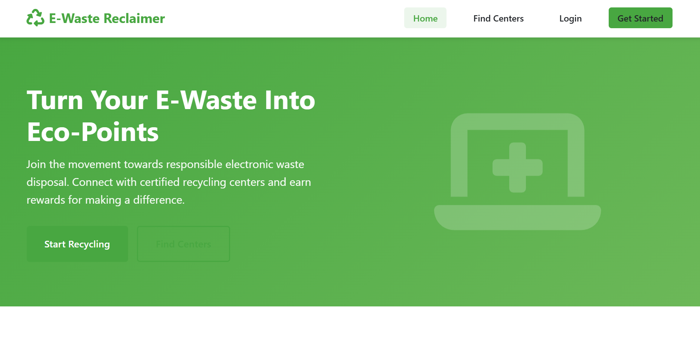

# E-Waste Reclaimer

A full-stack web application for responsible electronic waste disposal, connecting users with certified recycling centers.

## Features
### User Features

- **User Registration & Login**: Secure authentication with bcrypt password hashing
- **E-Waste Submission**: Submit electronic waste items with photo upload
- **Status Tracking**: Track items from Pending → Collected → Recycled
- **Eco-Points System**: Earn points for recycled items
- **Leaderboard**: View top contributors
- **Find Centers**: Locate nearby recycling centers

### Admin Features

- **Dashboard Analytics**: View total items, users, and recycling progress
- **Status Management**: Update item status (Pending/Collected/Recycled)
- **Visual Charts**: Category and status distribution charts using Chart.js
- **User Management**: View all registered users
- **Center Management**: Add/edit recycling centers

## Tech Stack

- **Backend**: Node.js, Express.js
- **Database**: Supabase (PostgreSQL)
- **Frontend**: Vanilla HTML, CSS, JavaScript
- **Authentication**: Express-session, bcrypt
- **File Upload**: Multer
- **Charts**: Chart.js

## Installation

1. Install dependencies:
```bash
npm install
```

2. Set up environment variables in `.env`:
```
PORT=3000
SESSION_SECRET=your-secret-key
SUPABASE_URL=your-supabase-url
SUPABASE_ANON_KEY=your-supabase-key
```

3. Create an admin user (optional):
```bash
node create-admin.js
```

Default admin credentials:
- Email: admin@ewaste.com
- Password: admin123

4. Start the server:
```bash
npm start
```

5. Visit `http://localhost:3000`

## Project Structure

```
/e-waste-reclaimer
├── /public
│   ├── index.html          # Landing page
│   ├── register.html       # User registration
│   ├── login.html          # User/Admin login
│   ├── dashboard.html      # User dashboard
│   ├── admin.html          # Admin control panel
│   ├── centers.html        # Recycling centers list
│   ├── /css
│   │   └── style.css       # Complete styling
│   ├── /js
│   │   ├── script.js       # Main JS
│   │   ├── dashboard.js    # User dashboard logic
│   │   └── admin.js        # Admin dashboard logic
│   └── /uploads            # Uploaded images
├── /routes
│   ├── userRoutes.js       # Authentication & user routes
│   ├── ewasteRoutes.js     # E-waste CRUD operations
│   └── adminRoutes.js      # Admin management routes
├── /models
│   ├── db.js               # Supabase connection
│   ├── User.js             # User model
│   ├── Ewaste.js           # E-waste model
│   └── Center.js           # Center model
├── server.js               # Express server
├── create-admin.js         # Admin user creation script
├── package.json
└── .env
```

## Database Schema

### users
- id (uuid, primary key)
- name (text)
- email (text, unique)
- password (text, hashed)
- role (text: 'user' or 'admin')
- points (integer)
- created_at (timestamp)

### ewaste_items
- id (uuid, primary key)
- user_id (uuid, foreign key)
- name (text)
- category (text)
- condition (text)
- location (text)
- image (text)
- description (text)
- status (text: Pending/Collected/Recycled)
- date_submitted (timestamp)
- updated_at (timestamp)

### centers
- id (uuid, primary key)
- name (text)
- address (text)
- contact (text)
- created_at (timestamp)

## API Endpoints

### User Routes
- POST `/api/users/register` - Register new user
- POST `/api/users/login` - User login
- POST `/api/users/logout` - User logout
- GET `/api/users/profile` - Get user profile
- GET `/api/users/leaderboard` - Get top contributors

### E-Waste Routes
- POST `/api/ewaste/submit` - Submit new e-waste item
- GET `/api/ewaste/my-items` - Get user's items
- GET `/api/ewaste/item/:id` - Get specific item
- PUT `/api/ewaste/item/:id` - Update item
- DELETE `/api/ewaste/item/:id` - Delete item
- GET `/api/ewaste/centers` - Get all recycling centers

### Admin Routes
- GET `/api/admin/stats` - Get dashboard statistics
- GET `/api/admin/items` - Get all items
- PUT `/api/admin/item/:id/status` - Update item status
- GET `/api/admin/users` - Get all users
- POST `/api/admin/centers` - Create recycling center
- PUT `/api/admin/centers/:id` - Update center
- DELETE `/api/admin/centers/:id` - Delete center

## Security Features

- Row Level Security (RLS) enabled on all tables
- Password hashing with bcrypt
- Session-based authentication
- File upload validation (images only, 5MB limit)
- Protected admin routes
- SQL injection prevention via parameterized queries

## UN SDG Alignment

This project supports **UN Sustainable Development Goal 12: Responsible Consumption and Production** by promoting proper electronic waste disposal and recycling practices.

## Future Enhancements

- Email notifications on status changes (Nodemailer)
- QR code generation for tracking
- Dark/light mode toggle
- Advanced filtering and search
- Mobile application
- Location-based center recommendations

## License

MIT License

## Support

For issues or questions, contact: info@ewastereclaimer.org
